<p align="center">
  
</p>

<p align="center">
  Electronic Engineer specializing in telematics, networking, and automation.<br>
  Builder of practical tools for terminal workflows, network operations, and infrastructure reliability.
</p>

<p align="center">
  <a href="https://www.christiandassy.com"></a>
  <a href="https://github.com/inxbit/prismtty"></a>
  
  <a href="https://prismtty.com/"></a>
</p>

---

### Operator-First Networking

I work at the intersection of network engineering, Unix systems, and automation.
I like turning noisy operational data into something clear, searchable, and
repeatable: terminal output, device sessions, logs, release workflows, and the
small pieces of glue that make infrastructure easier to operate.

Routing protocols are where networking gets interesting. I have a soft spot for
BGP and the discipline around it: BGP everywhere, but backed by clear policy,
useful visibility, and sane operations.

I care about operational clarity: seeing what changed, understanding why, and
leaving systems easier to maintain than I found them.

```text
route preference:
  bgp: everywhere
  policy: explicit
  visibility: before heroics
  tools: boring enough to trust
```

### Current Build

| Project | What it is | Why it matters |
| --- | --- | --- |
| [PrismTTY](https://github.com/inxbit/prismtty) | Fast terminal output highlighter for network devices and Unix systems. | Makes dense terminal output easier to scan during real operational work. |
| [prismtty.com](https://prismtty.com/) | Project site and user-facing documentation. | Keeps installation, usage, and release details easy to find. |
| [homebrew-tap](https://github.com/inxbit/homebrew-tap) | Homebrew release channel for Inxbit projects. | Keeps CLI tools installable with a normal operator workflow. |

```sh
brew install inxbit/tap/prismtty
```

### Focus Areas

- Routing protocols, BGP design, and route-policy clarity.
- Network automation and device operations.
- Rust and Python CLI tooling.
- Terminal UX, PTY behavior, parsing, and output highlighting.
- Fortinet and FortiAnalyzer operational workflows.
- Release packaging, documentation, and operational polish.

### Toolbox

<p>
  
  
  
  
  
  
</p>

### Operating Bias

- Make the path visible before making it clever.
- Build small tools that solve real operator problems.
- Prefer safe defaults, clear documentation, and reproducible workflows.
- Keep automation readable enough to trust during an incident.
- Treat polish as part of reliability, not decoration.

### Connect

[Portfolio](https://www.christiandassy.com) ·
[PrismTTY](https://prismtty.com/) ·
[GitHub](https://github.com/inxbit)
